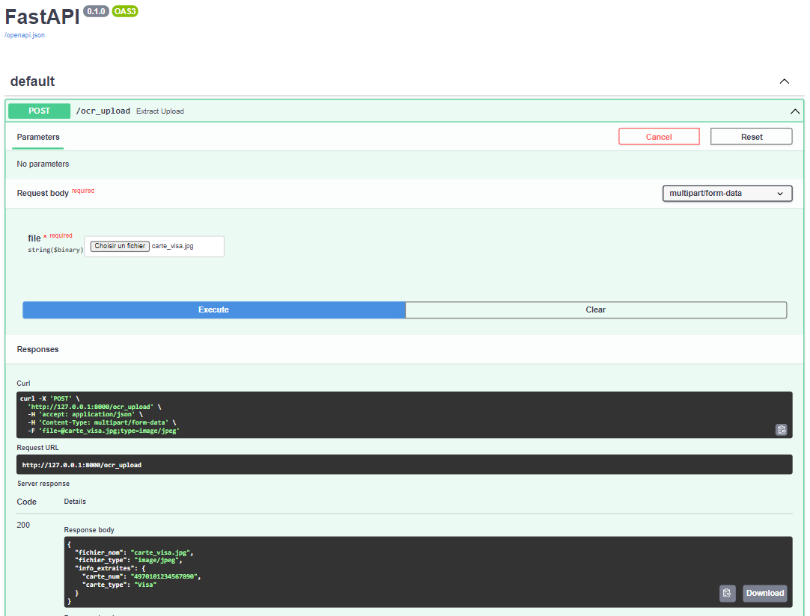

FastAPI est un framework python qui permet de mettre en place des API robustes, performantes, faciles à maintenir.

Ce projet vise à montrer de façon simple la création d'une API avec FastAPI. Dans notre exemple, nous allons construire une API qui fourit le numéro et le type d'une carte bancaire à partir de l'image.

On a deux façons de tester l'API:
* Avec l'interface fournie par FastAPI (http://127.0.0.1:8000/docs)


* En voyant une requête directement à l'API:

```python
import requests

image_path =  'carte_visa_1.jpg'
image_data = open(image_path, "rb").read()
data_str = image_data.decode('ISO-8859-1')
ocr_url = 'http://127.0.0.1:8000/ocr_image_string'
response = requests.post(ocr_url, json={'image_str': data_str})
response.json()
```

Le résultat de la requête est :

```
{'carte_num': '4970101234567890', 'carte_type': 'Visa'}
```


```python

```
